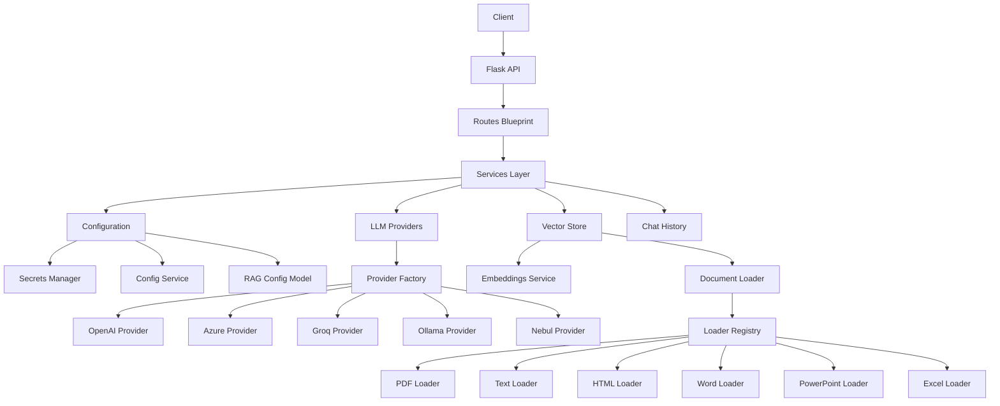

# RAG Service Architecture

## Overview



## Directory Layout

```
rag/
├── __init__.py
├── app.py                     # Application factory & CLI entry point
├── api/
│   ├── __init__.py
│   ├── routes.py              # Flask Blueprint with all endpoints
│   └── middleware.py           # CORS, error handlers, teardown
├── config/
│   ├── __init__.py
│   ├── constants.py            # Application-wide constants
│   ├── secrets.py              # Docker-secrets / env-var loader
│   └── settings.py             # INI file reader (ConfigService)
├── models/
│   ├── __init__.py
│   ├── config_models.py        # RAGConfig dataclass
│   ├── response_models.py      # APIResponse Pydantic model
│   └── llm/
│       ├── __init__.py
│       ├── base.py             # LLMProvider ABC
│       ├── factory.py          # ProviderFactory
│       ├── openai_provider.py
│       ├── azure_provider.py
│       ├── groq_provider.py
│       ├── ollama_provider.py
│       └── nebul_provider.py
├── services/
│   ├── __init__.py
│   ├── embeddings.py           # Lazy-loaded embedding functions
│   ├── chat_history.py         # In-memory session history
│   ├── vector_store.py         # ChromaDB vector store ops
│   └── document_loader/
│       ├── __init__.py
│       ├── base.py             # DocumentLoaderStrategy Protocol
│       ├── registry.py         # Loader registry & dispatcher
│       ├── pdf_loader.py
│       ├── text_loader.py
│       ├── html_loader.py
│       ├── word_loader.py
│       ├── powerpoint_loader.py
│       └── excel_loader.py
└── utils/
    ├── __init__.py
    ├── cache.py                # LRU-cache helpers
    ├── exceptions.py           # Custom exception hierarchy
    ├── logging_config.py       # Logging setup
    └── security.py             # Path / file validation utilities
```

## Component Responsibilities

### Configuration Layer (`rag/config/`)

| Module | Purpose |
|--------|---------|
| **constants.py** | Immutable application defaults (max upload size, allowed extensions, temperature bounds, secret paths, log levels). |
| **secrets.py** – `SecretsManager` | Loads credentials from Docker `/run/secrets` or `.env` files and exposes them via `get_secret()`. |
| **settings.py** – `ConfigService` | Reads per-project INI files with typed accessors (`get_string`, `get_int`, `get_float`, `get_boolean`, `get_list`). |

### Models Layer (`rag/models/`)

| Module | Purpose |
|--------|---------|
| **config_models.py** – `RAGConfig` | Typed dataclass that validates temperature, paths, etc. Constructed via `from_config_file()`. |
| **response_models.py** – `APIResponse` | Pydantic model ensuring every API response has `success`, `data`, `error` and `timestamp`. |
| **llm/base.py** – `LLMProvider` | Abstract base class that every provider must implement: `get_model_names`, `create_chat_model`, `create_embeddings`. |
| **llm/factory.py** – `ProviderFactory` | Maps provider names (`OPENAI`, `AZURE`, …) to classes. Supports `register_provider()` for extensions. |

### Services Layer (`rag/services/`)

| Module | Purpose |
|--------|---------|
| **embeddings.py** – `EmbeddingsService` | Lazy-creates the embedding function via the current provider. |
| **chat_history.py** – `ChatHistoryService` | Manages per-session `InMemoryHistory` objects. |
| **vector_store.py** – `VectorStoreService` | Initialises ChromaDB, exposes `reload_documents()` and `search_similar()`. |
| **document_loader/** | Strategy-pattern loaders for PDF, TXT, HTML, DOCX, PPTX, XLSX. The `DocumentLoaderRegistry` dispatches by file type. |

### API Layer (`rag/api/`)

| Module | Purpose |
|--------|---------|
| **routes.py** | Flask Blueprint (`rag_bp`) with all HTTP endpoints extracted from the legacy `ragservice.py`. |
| **middleware.py** | `setup_middleware()` – CORS, preflight handling, HTTP-error and unhandled-exception catchers. |

### Utilities (`rag/utils/`)

| Module | Purpose |
|--------|---------|
| **exceptions.py** | `RAGException` hierarchy: `ConfigurationError`, `ProviderError`, `DocumentLoadError`, `VectorStoreError`, `ValidationError`, `SecurityError`. |
| **logging_config.py** | `setup_logging()` / `get_logger()` convenience wrappers. |
| **security.py** | `allowed_file()`, `secure_upload_filename()`, `validate_path()`, `sanitize_for_logging()`, `generate_unique_filename()`. |
| **cache.py** | `@lru_cache`-based helpers for embeddings and config reads. |

## Data Flow

```
1. Client  ──HTTP──▸  Flask (middleware)
2. Flask   ──route──▸  routes.py handler
3. Handler  ────────▸  VectorStoreService.search_similar()
                    ▸  ChatHistoryService.get_session_history()
                    ▸  RAG chain (LangChain)
4. RAG chain ───────▸  LLMProvider.create_chat_model()
                    ▸  EmbeddingsService.embeddings
5. Response ◂───────  APIResponse / make_response
```

## Migration Path

1. **Run the new entry point** side-by-side with the old one:
   ```bash
   python ragservice_new.py <project>
   ```
2. Compare behaviour on the same prompts.
3. Once satisfied, archive the legacy file:
   ```bash
   mv ragservice.py ragservice_legacy.py
   mv ragservice_new.py ragservice.py
   ```

## Test Commands

```bash
# All unit tests
python -m pytest tests/ -v

# With coverage
python -m pytest tests/ --cov=rag --cov-report=term-missing

# Single test file
python -m pytest tests/unit/test_config_service.py -v

# Legacy integration tests
python ragservice_unittest.py -v
```
