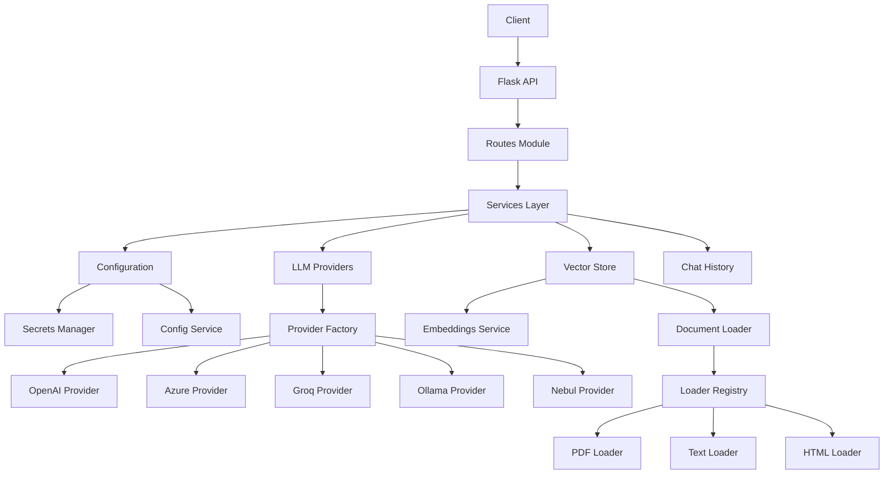

# RAG Service Refactoring Plan

This document provides a detailed, step-by-step plan to refactor the RAG Service according to the recommendations in [`REFACTOR.md`](../REFACTOR.md).

## Overview

The refactoring will be executed in 3 phases over multiple iterations, ensuring that existing functionality remains intact throughout the process. Each phase builds upon the previous one, gradually transforming the codebase into a more maintainable, testable, and scalable system.

## Phase 1: Foundation (High Priority)

### Goal
Establish the core architectural improvements that will enable all subsequent refactoring work.

---

### Step 1: Create New Directory Structure

**Objective:** Set up the modular architecture without disrupting existing code.

**Actions:**
1. Create the following directory structure:
```
rag/
├── __init__.py
├── config/
│   ├── __init__.py
│   ├── settings.py          # ConfigService class
│   ├── secrets.py           # SecretsManager class
│   └── constants.py         # Application constants
├── models/
│   ├── __init__.py
│   ├── config_models.py     # RAGConfig dataclass
│   ├── response_models.py   # APIResponse models
│   └── llm/
│       ├── __init__.py
│       ├── base.py          # LLMProvider ABC
│       ├── factory.py       # ProviderFactory
│       ├── openai_provider.py
│       ├── azure_provider.py
│       ├── groq_provider.py
│       ├── ollama_provider.py
│       └── nebul_provider.py
├── services/
│   ├── __init__.py
│   ├── vector_store.py      # Vector store operations
│   ├── embeddings.py        # Embedding functions
│   ├── chat_history.py      # Chat history management
│   └── document_loader/
│       ├── __init__.py
│       ├── base.py          # DocumentLoaderStrategy protocol
│       ├── registry.py      # DocumentLoaderRegistry
│       ├── pdf_loader.py
│       ├── text_loader.py
│       ├── html_loader.py
│       ├── word_loader.py
│       ├── powerpoint_loader.py
│       └── excel_loader.py
├── api/
│   ├── __init__.py
│   ├── routes.py            # Flask routes
│   └── middleware.py        # Error handlers, CORS
└── utils/
    ├── __init__.py
    ├── security.py          # File validation, path security
    └── logging_config.py    # Logging configuration
```

2. Create empty `__init__.py` files in each directory
3. Keep existing [`ragservice.py`](../ragservice.py) and [`configservice.py`](../configservice.py) unchanged for now

**Validation:**
- Directory structure exists
- All `__init__.py` files are present
- Existing services still run without errors

---

### Step 2: Implement Core Configuration Classes

**Objective:** Create the foundation for configuration management.

#### 2.1: Create Constants Module

**File:** `rag/config/constants.py`

**Content:**
```python
"""Application-wide constants."""

# File upload settings
DEFAULT_MAX_MB_SIZE = 16
ALLOWED_EXTENSIONS = {'txt', 'pdf', 'docx', 'pptx', 'xlsx', 'html'}
MAX_FILENAME_LENGTH = 255

# Temperature bounds
DEFAULT_TEMPERATURE_MIN = 0.0
DEFAULT_TEMPERATURE_MAX = 2.0

# Service settings
DEFAULT_CONFIG_PORT = 8000
DEFAULT_RAG_PORT = 5000

# Secrets and environment
SECRETS_DIR = "/run/secrets"
ENV_FILE = "env/config.env"

# Logging levels
LOG_LEVELS = {
    'DEBUG': 'DEBUG',
    'INFO': 'INFO',
    'WARNING': 'WARNING',
    'ERROR': 'ERROR',
    'CRITICAL': 'CRITICAL'
}
```

**Validation:**
- File created successfully
- Constants can be imported: `from rag.config.constants import DEFAULT_MAX_MB_SIZE`

#### 2.2: Create SecretsManager Class

**File:** `rag/config/secrets.py`

**Content:**
```python
"""Unified secrets management for API keys and credentials."""

import os
import logging
from typing import Optional
from pathlib import Path
from dotenv import load_dotenv
from .constants import SECRETS_DIR, ENV_FILE


class SecretsManager:
    """Manages secrets from Docker secrets and environment variables."""
    
    def __init__(self, secrets_dir: str = SECRETS_DIR, env_file: str = ENV_FILE):
        """
        Initialize the secrets manager.
        
        Args:
            secrets_dir: Directory containing Docker secrets
            env_file: Path to .env file
        """
        self.secrets_dir = Path(secrets_dir)
        self.env_file = env_file
        self._load_environment()
    
    def _load_environment(self) -> None:
        """Load environment variables from .env file if it exists."""
        if os.path.exists(self.env_file):
            logging.info("Loading environment variables from %s", self.env_file)
            load_dotenv(self.env_file)
    
    def get_secret(self, key: str) -> Optional[str]:
        """
        Get a secret value, checking Docker secrets first, then environment variables.
        
        Args:
            key: The secret key to retrieve
            
        Returns:
            The secret value, or None if not found
            
        Example:
            >>> manager = SecretsManager()
            >>> api_key = manager.get_secret('OPENAI_APIKEY')
        """
        # Try Docker secrets first
        secret_path = self.secrets_dir / key.lower()
        if secret_path.exists():
            try:
                return secret_path.read_text().strip()
            except Exception as e:
                logging.error("Error reading secret from %s: %s", secret_path, e)
        
        # Fall back to environment variable
        return os.environ.get(key)
    
    def load_all_secrets(self) -> None:
        """Load all known secrets into environment variables."""
        secret_keys = [
            'AZURE_AI_APIKEY',
            'AZURE_OPENAI_APIKEY',
            'OPENAI_APIKEY',
            'OLLAMA_APIKEY',
            'GROQ_APIKEY',
            'NEBUL_APIKEY'
        ]
        
        for key in secret_keys:
            value = self.get_secret(key)
            if value:
                os.environ[key] = value
                logging.debug("Loaded secret: %s", key)
```

**Validation:**
- Class can be instantiated
- `get_secret()` returns values from environment
- Test with unittest secrets

#### 2.3: Create ConfigService Class

**File:** `rag/config/settings.py`

**Content:**
```python
"""Configuration service for reading and managing INI configuration files."""

import configparser
import logging
from typing import Optional, Any
from pathlib import Path


class ConfigError(Exception):
    """Custom exception for configuration errors."""
    pass


class ConfigService:
    """Service for reading configuration from INI files."""
    
    def __init__(self, config_file: str):
        """
        Initialize the configuration service.
        
        Args:
            config_file: Path to the INI configuration file
            
        Raises:
            ConfigError: If the configuration file cannot be read
        """
        self.config_file = Path(config_file)
        self.parser = configparser.ConfigParser()
        
        if not self.config_file.exists():
            raise ConfigError(f"Configuration file not found: {config_file}")
        
        try:
            self.parser.read(self.config_file)
        except Exception as e:
            raise ConfigError(f"Error reading configuration file: {e}")
    
    def get_string(self, section: str, key: str, default: Optional[str] = None) -> str:
        """
        Get a string value from the configuration.
        
        Args:
            section: Configuration section
            key: Configuration key
            default: Default value if key not found
            
        Returns:
            The configuration value
            
        Raises:
            ConfigError: If key not found and no default provided
        """
        try:
            return self.parser.get(section, key)
        except (configparser.NoSectionError, configparser.NoOptionError) as e:
            if default is not None:
                return default
            raise ConfigError(f"Configuration key not found: [{section}] {key}") from e
    
    def get_int(self, section: str, key: str, default: Optional[int] = None) -> int:
        """Get an integer value from the configuration."""
        try:
            return self.parser.getint(section, key)
        except (configparser.NoSectionError, configparser.NoOptionError) as e:
            if default is not None:
                return default
            raise ConfigError(f"Configuration key not found: [{section}] {key}") from e
        except ValueError as e:
            raise ConfigError(f"Invalid integer value for [{section}] {key}") from e
    
    def get_float(self, section: str, key: str, default: Optional[float] = None) -> float:
        """Get a float value from the configuration."""
        try:
            return self.parser.getfloat(section, key)
        except (configparser.NoSectionError, configparser.NoOptionError) as e:
            if default is not None:
                return default
            raise ConfigError(f"Configuration key not found: [{section}] {key}") from e
        except ValueError as e:
            raise ConfigError(f"Invalid float value for [{section}] {key}") from e
    
    def get_boolean(self, section: str, key: str, default: Optional[bool] = None) -> bool:
        """Get a boolean value from the configuration."""
        try:
            return self.parser.getboolean(section, key)
        except (configparser.NoSectionError, configparser.NoOptionError) as e:
            if default is not None:
                return default
            raise ConfigError(f"Configuration key not found: [{section}] {key}") from e
        except ValueError as e:
            raise ConfigError(f"Invalid boolean value for [{section}] {key}") from e
    
    def has_option(self, section: str, key: str) -> bool:
        """Check if a configuration option exists."""
        return self.parser.has_option(section, key)
    
    def get_list(self, section: str, key: str, separator: str = ',', 
                 default: Optional[list] = None) -> list:
        """
        Get a list value from the configuration.
        
        Args:
            section: Configuration section
            key: Configuration key
            separator: Character to split the value on
            default: Default value if key not found
            
        Returns:
            List of string values
        """
        try:
            value = self.parser.get(section, key)
            return [item.strip() for item in value.split(separator)]
        except (configparser.NoSectionError, configparser.NoOptionError) as e:
            if default is not None:
                return default
            raise ConfigError(f"Configuration key not found: [{section}] {key}") from e
```

**Validation:**
- Can read from existing constants files
- Proper error handling for missing keys
- Default values work correctly

#### 2.4: Create RAGConfig Dataclass

**File:** `rag/models/config_models.py`

**Content:**
```python
"""Configuration models for RAG service."""

from dataclasses import dataclass, field
from typing import Optional
import logging
from rag.config.settings import ConfigService
from rag.config.constants import DEFAULT_TEMPERATURE_MIN, DEFAULT_TEMPERATURE_MAX


@dataclass
class RAGConfig:
    """Configuration for RAG service instance."""
    
    # Project identification
    project: str
    
    # LLM settings
    use_llm: str
    model_text: str
    embedding_model: str
    temperature: float
    max_tokens: float
    
    # Retrieval settings
    similar: int
    score: float
    
    # Document processing
    chunk_size: int
    chunk_overlap: int
    
    # Prompts
    contextualize_q_system_prompt: str
    system_prompt: str
    
    # Directories
    data_dir: str
    persistence_dir: str
    html_dir: str
    
    # Flask settings
    port: int
    max_mb_size: int
    
    # Logging
    logging_level: str
    
    # Runtime state (not from config)
    session_id: Optional[str] = None
    timestamp: Optional[str] = None
    
    def __post_init__(self):
        """Validate configuration after initialization."""
        self._validate_temperature()
        self._validate_paths()
    
    def _validate_temperature(self):
        """Ensure temperature is within valid range."""
        if not (DEFAULT_TEMPERATURE_MIN <= self.temperature <= DEFAULT_TEMPERATURE_MAX):
            raise ValueError(
                f"Temperature must be between {DEFAULT_TEMPERATURE_MIN} and "
                f"{DEFAULT_TEMPERATURE_MAX}, got {self.temperature}"
            )
    
    def _validate_paths(self):
        """Validate that required paths are set."""
        if not self.data_dir:
            raise ValueError("data_dir must be specified")
        if not self.persistence_dir:
            raise ValueError("persistence_dir must be specified")
    
    @classmethod
    def from_config_file(cls, config_service: ConfigService, project: str) -> 'RAGConfig':
        """
        Create RAGConfig from a ConfigService instance.
        
        Args:
            config_service: ConfigService instance with loaded configuration
            project: Project identifier
            
        Returns:
            RAGConfig instance
            
        Example:
            >>> config_service = ConfigService('constants/constants_myproject.ini')
            >>> rag_config = RAGConfig.from_config_file(config_service, 'myproject')
        """
        # Get LLM provider
        use_llm = config_service.get_string('LLMS', 'use_llm')
        llm_section = f'LLMS.{use_llm}'
        
        return cls(
            project=project,
            use_llm=use_llm,
            model_text=config_service.get_string(llm_section, 'modeltext'),
            embedding_model=config_service.get_string(llm_section, 'embedding_model'),
            temperature=config_service.get_float('DEFAULT', 'temperature'),
            max_tokens=config_service.get_float('DEFAULT', 'max_tokens'),
            similar=config_service.get_int('DEFAULT', 'similar'),
            score=config_service.get_float('DEFAULT', 'score'),
            chunk_size=config_service.get_int('DEFAULT', 'chunk_size'),
            chunk_overlap=config_service.get_int('DEFAULT', 'chunk_overlap'),
            contextualize_q_system_prompt=config_service.get_string(
                'DEFAULT', 'contextualize_q_system_prompt'
            ),
            system_prompt=config_service.get_string('DEFAULT', 'system_prompt'),
            data_dir=config_service.get_string('DEFAULT', 'data_dir'),
            persistence_dir=config_service.get_string('DEFAULT', 'persistence'),
            html_dir=config_service.get_string('DEFAULT', 'html'),
            port=config_service.get_int('FLASK', 'port'),
            max_mb_size=config_service.get_int('FLASK', 'max_mb_size'),
            logging_level=config_service.get_string('DEFAULT', 'logging_level')
        )
```

**Validation:**
- Can create RAGConfig from existing constants files
- Validation works correctly
- All fields are properly typed

---

### Step 3: Implement LLM Provider System

**Objective:** Replace hardcoded match statements with extensible provider pattern.

#### 3.1: Create LLMProvider Base Class

**File:** `rag/models/llm/base.py`

**Content:**
```python
"""Base class for LLM providers."""

from abc import ABC, abstractmethod
from typing import List, Tuple, Optional
from rag.models.config_models import RAGConfig


class LLMProvider(ABC):
    """Abstract base class for LLM providers."""
    
    def __init__(self, config: RAGConfig):
        """
        Initialize the provider with configuration.
        
        Args:
            config: RAG configuration instance
        """
        self.config = config
    
    @abstractmethod
    def get_model_names(self) -> Tuple[List[str], List[str]]:
        """
        Get available model and embedding names for this provider.
        
        Returns:
            Tuple of (model_names, embedding_names)
        """
        pass
    
    @abstractmethod
    def create_chat_model(self, temperature: Optional[float] = None):
        """
        Create a chat model instance.
        
        Args:
            temperature: Optional temperature override
            
        Returns:
            LangChain chat model instance
        """
        pass
    
    @abstractmethod
    def create_embeddings(self):
        """
        Create an embeddings instance.
        
        Returns:
            LangChain embeddings instance
        """
        pass
    
    def validate_model(self, model_name: str, embedding_name: str) -> None:
        """
        Validate that the specified models are available.
        
        Args:
            model_name: Name of the chat model
            embedding_name: Name of the embedding model
            
        Raises:
            ValueError: If models are not available
        """
        model_names, embedding_names = self.get_model_names()
        
        if model_name not in model_names:
            raise ValueError(
                f"Model '{model_name}' not found in {self.__class__.__name__}. "
                f"Available models: {', '.join(model_names)}"
            )
        
        if embedding_name not in embedding_names:
            raise ValueError(
                f"Embedding '{embedding_name}' not found in {self.__class__.__name__}. "
                f"Available embeddings: {', '.join(embedding_names)}"
            )
```

**Validation:**
- Base class can be imported
- Abstract methods are properly defined

#### 3.2: Implement Provider Classes

Create one provider class at a time, starting with OpenAI:

**File:** `rag/models/llm/openai_provider.py`

**Content:**
```python
"""OpenAI LLM provider implementation."""

import os
import logging
from typing import List, Tuple
import openai
from langchain_openai import ChatOpenAI, OpenAIEmbeddings
from .base import LLMProvider


class OpenAIProvider(LLMProvider):
    """OpenAI provider implementation."""
    
    def get_model_names(self) -> Tuple[List[str], List[str]]:
        """Get available OpenAI models and embeddings."""
        api_key = os.environ.get('OPENAI_APIKEY')
        if not api_key:
            raise ValueError("OPENAI_APIKEY not found in environment")
        
        client = openai.OpenAI(api_key=api_key)
        models = client.models.list().data
        
        # Filter embedding models
        embedding_names = sorted([
            str(dict(model)['id'])
            for model in models
            if str(dict(model)['id']).startswith('text')
        ])
        
        # Filter chat models
        model_names = sorted([
            str(dict(model)['id'])
            for model in models
            if str(dict(model)['id']).startswith(('gpt', 'o1', 'o3'))
            and 'audio' not in str(dict(model)['id'])
            and 'video' not in str(dict(model)['id'])
        ])
        
        return model_names, embedding_names
    
    def create_chat_model(self, temperature=None):
        """Create OpenAI chat model."""
        api_key = os.environ.get('OPENAI_APIKEY')
        if not api_key:
            raise ValueError("OPENAI_APIKEY not found in environment")
        
        temp = temperature if temperature is not None else self.config.temperature
        
        return ChatOpenAI(
            api_key=api_key,
            model=self.config.model_text,
            temperature=temp,
            verbose=True
        )
    
    def create_embeddings(self):
        """Create OpenAI embeddings."""
        api_key = os.environ.get('OPENAI_APIKEY')
        if not api_key:
            raise ValueError("OPENAI_APIKEY not found in environment")
        
        return OpenAIEmbeddings(
            api_key=api_key,
            model=self.config.embedding_model
        )
```

**Similar files to create:**
- `rag/models/llm/azure_provider.py`
- `rag/models/llm/groq_provider.py`
- `rag/models/llm/ollama_provider.py`
- `rag/models/llm/nebul_provider.py`

#### 3.3: Create ProviderFactory

**File:** `rag/models/llm/factory.py`

**Content:**
```python
"""Factory for creating LLM providers."""

from typing import Dict, Type
from .base import LLMProvider
from .openai_provider import OpenAIProvider
from .azure_provider import AzureProvider
from .groq_provider import GroqProvider
from .ollama_provider import OllamaProvider
from .nebul_provider import NebulProvider
from rag.models.config_models import RAGConfig


class ProviderFactory:
    """Factory for creating LLM provider instances."""
    
    _providers: Dict[str, Type[LLMProvider]] = {
        'OPENAI': OpenAIProvider,
        'AZURE': AzureProvider,
        'GROQ': GroqProvider,
        'OLLAMA': OllamaProvider,
        'NEBUL': NebulProvider,
    }
    
    @classmethod
    def get_provider(cls, provider_name: str, config: RAGConfig) -> LLMProvider:
        """
        Get a provider instance by name.
        
        Args:
            provider_name: Name of the provider (e.g., 'OPENAI', 'AZURE')
            config: RAG configuration instance
            
        Returns:
            LLMProvider instance
            
        Raises:
            ValueError: If provider name is not recognized
            
        Example:
            >>> config = RAGConfig.from_config_file(config_service, 'myproject')
            >>> provider = ProviderFactory.get_provider('OPENAI', config)
            >>> chat_model = provider.create_chat_model()
        """
        provider_class = cls._providers.get(provider_name)
        if not provider_class:
            available = ', '.join(cls._providers.keys())
            raise ValueError(
                f"Unknown provider: {provider_name}. "
                f"Available providers: {available}"
            )
        
        return provider_class(config)
    
    @classmethod
    def register_provider(cls, name: str, provider_class: Type[LLMProvider]) -> None:
        """
        Register a new provider class.
        
        Args:
            name: Provider name
            provider_class: Provider class to register
        """
        cls._providers[name] = provider_class
    
    @classmethod
    def list_providers(cls) -> list:
        """Get list of available provider names."""
        return list(cls._providers.keys())
```

**Validation:**
- Factory can create provider instances
- All providers implement required methods
- Validation works correctly

---

### Step 4: Implement Document Loading System

**Objective:** Replace complex match statements with strategy pattern for document loading.

#### 4.1: Create DocumentLoaderStrategy Protocol

**File:** `rag/services/document_loader/base.py`

**Content:**
```python
"""Base protocol for document loader strategies."""

from typing import Protocol, Dict, Any
from langchain_chroma import Chroma


class DocumentLoaderStrategy(Protocol):
    """Protocol for document loader strategies."""
    
    def load(self, config: Dict[str, Any], vectorstore: Chroma) -> int:
        """
        Load documents into the vector store.
        
        Args:
            config: Configuration dictionary containing:
                - data_dir: Directory containing documents
                - glob: File pattern to match
                - chunk_size: Size of text chunks
                - chunk_overlap: Overlap between chunks
            vectorstore: Vector store to add documents to
            
        Returns:
            Number of document splits loaded
        """
        ...
```

#### 4.2: Implement Loader Strategies

Create loader for each file type. Example for PDF:

**File:** `rag/services/document_loader/pdf_loader.py`

**Content:**
```python
"""PDF document loader strategy."""

import logging
from typing import Dict, Any
from langchain_chroma import Chroma
from langchain_community.document_loaders import PyPDFDirectoryLoader
from langchain_text_splitters import RecursiveCharacterTextSplitter


class PDFLoaderStrategy:
    """Strategy for loading PDF documents."""
    
    def load(self, config: Dict[str, Any], vectorstore: Chroma) -> int:
        """Load PDF documents into vector store."""
        text_splitter = RecursiveCharacterTextSplitter(
            chunk_size=config['chunk_size'],
            chunk_overlap=config['chunk_overlap']
        )
        
        loader = PyPDFDirectoryLoader(
            path=config['data_dir'],
            glob=config['glob']
        )
        
        try:
            splits = loader.load_and_split()
            if splits:
                vectorstore.add_documents(splits)
                logging.info("Loaded %d PDF document splits", len(splits))
                return len(splits)
        except Exception as e:
            logging.error("Error loading PDF documents: %s", e)
        
        return 0
```

**Similar files to create:**
- `rag/services/document_loader/text_loader.py`
- `rag/services/document_loader/html_loader.py`
- `rag/services/document_loader/word_loader.py`
- `rag/services/document_loader/powerpoint_loader.py`
- `rag/services/document_loader/excel_loader.py`

#### 4.3: Create DocumentLoaderRegistry

**File:** `rag/services/document_loader/registry.py`

**Content:**
```python
"""Registry for document loader strategies."""

import logging
from typing import Dict, Any
from langchain_chroma import Chroma
from .pdf_loader import PDFLoaderStrategy
from .text_loader import TextLoaderStrategy
from .html_loader import HTMLLoaderStrategy
from .word_loader import WordLoaderStrategy
from .powerpoint_loader import PowerPointLoaderStrategy
from .excel_loader import ExcelLoaderStrategy


class DocumentLoaderRegistry:
    """Registry for managing document loader strategies."""
    
    def __init__(self):
        """Initialize the registry with default loaders."""
        self._loaders = {
            'pdf': PDFLoaderStrategy(),
            'txt': TextLoaderStrategy(),
            'html': HTMLLoaderStrategy(),
            'docx': WordLoaderStrategy(),
            'pptx': PowerPointLoaderStrategy(),
            'xlsx': ExcelLoaderStrategy(),
        }
    
    def load_documents(
        self, 
        file_type: str, 
        config: Dict[str, Any], 
        vectorstore: Chroma
    ) -> int:
        """
        Load documents of specified type into vector store.
        
        Args:
            file_type: Type of files to load ('pdf', 'txt', etc.) or 'all'
            config: Configuration dictionary
            vectorstore: Vector store instance
            
        Returns:
            Total number of document splits loaded
        """
        if file_type == 'all':
            total = 0
            for loader_type, loader in self._loaders.items():
                try:
                    count = loader.load(config, vectorstore)
                    total += count
                except Exception as e:
                    logging.error("Error loading %s files: %s", loader_type, e)
            return total
        
        loader = self._loaders.get(file_type)
        if not loader:
            raise ValueError(f"Unknown file type: {file_type}")
        
        return loader.load(config, vectorstore)
    
    def register_loader(self, file_type: str, loader) -> None:
        """Register a new loader strategy."""
        self._loaders[file_type] = loader
    
    def list_supported_types(self) -> list:
        """Get list of supported file types."""
        return list(self._loaders.keys())
```

**Validation:**
- Registry can load documents
- Each loader works independently
- 'all' option loads all file types

---

### Step 5: Extract Service Modules

**Objective:** Separate concerns into dedicated service modules.

#### 5.1: Create Embeddings Service

**File:** `rag/services/embeddings.py`

**Content:**
```python
"""Embeddings service for creating embedding functions."""

import logging
from langchain_core.embeddings import Embeddings
from rag.models.config_models import RAGConfig
from rag.models.llm.factory import ProviderFactory


class EmbeddingsService:
    """Service for managing embeddings."""
    
    def __init__(self, config: RAGConfig):
        """
        Initialize embeddings service.
        
        Args:
            config: RAG configuration instance
        """
        self.config = config
        self._embeddings = None
    
    @property
    def embeddings(self) -> Embeddings:
        """Get embeddings instance (lazy loaded)."""
        if self._embeddings is None:
            self._embeddings = self._create_embeddings()
        return self._embeddings
    
    def _create_embeddings(self) -> Embeddings:
        """Create embeddings instance from provider."""
        provider = ProviderFactory.get_provider(
            self.config.use_llm,
            self.config
        )
        logging.info(
            "Creating embeddings: %s with model %s",
            self.config.use_llm,
            self.config.embedding_model
        )
        return provider.create_embeddings()
    
    def reset(self) -> None:
        """Reset embeddings instance (useful for model changes)."""
        self._embeddings = None
```

#### 5.2: Create Chat History Service

**File:** `rag/services/chat_history.py`

**Content:**
```python
"""Chat history management service."""

import logging
from typing import Dict, List
from pydantic import BaseModel, Field
from langchain_core.chat_history import BaseChatMessageHistory
from langchain_core.messages import BaseMessage, AIMessage


class InMemoryHistory(BaseChatMessageHistory, BaseModel):
    """In-memory implementation of chat message history."""
    
    messages: List[BaseMessage] = Field(default_factory=list)
    
    def add_messages(self, messages: List[BaseMessage]) -> None:
        """Add a list of messages to the store."""
        self.messages.extend(messages)
    
    def clear(self) -> None:
        """Clear all messages from history."""
        self.messages = []


class ChatHistoryService:
    """Service for managing chat history across sessions."""
    
    def __init__(self):
        """Initialize the chat history service."""
        self._store: Dict[str, InMemoryHistory] = {}
    
    def get_session_history(self, session_id: str) -> BaseChatMessageHistory:
        """
        Get chat history for a session.
        
        Args:
            session_id: Session identifier
            
        Returns:
            Chat message history for the session
        """
        if session_id not in self._store:
            self._store[session_id] = InMemoryHistory()
        
        # Log existing messages
        for message in self._store[session_id].messages:
            prefix = "AI" if isinstance(message, AIMessage) else "User"
            logging.info("%s: %s", prefix, message.content)
        
        return self._store[session_id]
    
    def clear_session(self, session_id: str) -> None:
        """Clear history for a specific session."""
        if session_id in self._store:
            self._store[session_id].clear()
            logging.info("Cleared history for session: %s", session_id)
    
    def clear_all(self) -> None:
        """Clear all session histories."""
        self._store.clear()
        logging.info("Cleared all session histories")
    
    def get_all_sessions(self) -> List[str]:
        """Get list of all active session IDs."""
        return list(self._store.keys())
```

#### 5.3: Create Vector Store Service

**File:** `rag/services/vector_store.py`

**Content:**
```python
"""Vector store management service."""

import logging
from typing import Optional
from langchain_chroma import Chroma
import chromadb
from rag.models.config_models import RAGConfig
from rag.services.embeddings import EmbeddingsService
from rag.services.document_loader.registry import DocumentLoaderRegistry


class VectorStoreService:
    """Service for managing vector store operations."""
    
    def __init__(self, config: RAGConfig, embeddings_service: EmbeddingsService):
        """
        Initialize vector store service.
        
        Args:
            config: RAG configuration instance
            embeddings_service: Embeddings service instance
        """
        self.config = config
        self.embeddings_service = embeddings_service
        self._vectorstore: Optional[Chroma] = None
        self._document_loader = DocumentLoaderRegistry()
    
    @property
    def vectorstore(self) -> Chroma:
        """Get vector store instance (lazy loaded)."""
        if self._vectorstore is None:
            self._vectorstore = self._create_vectorstore()
        return self._vectorstore
    
    def _create_vectorstore(self) -> Chroma:
        """Create or load vector store."""
        logging.info("Initializing vector store at: %s", self.config.persistence_dir)
        
        vectorstore = Chroma(
            persist_directory=self.config.persistence_dir,
            embedding_function=self.embeddings_service.embeddings
        )
        
        # Check if vector store has existing data
        collection = vectorstore._collection
        count = collection.count()
        
        if count > 0:
            logging.info("Loaded %d chunks from persistent vectorstore", count)
        else:
            logging.info("Vector store is empty, loading documents...")
            self.reload_documents()
        
        return vectorstore
    
    def reload_documents(self, file_type: str = 'all') -> int:
        """
        Reload documents into vector store.
        
        Args:
            file_type: Type of files to load or 'all'
            
        Returns:
            Number of document splits loaded
        """
        logging.info("Reloading documents of type: %s", file_type)
        
        config_dict = {
            'data_dir': self.config.data_dir,
            'chunk_size': self.config.chunk_size,
            'chunk_overlap': self.config.chunk_overlap,
            'glob': f'*.{file_type}' if file_type != 'all' else '*.*'
        }
        
        count = self._document_loader.load_documents(
            file_type,
            config_dict,
            self.vectorstore
        )
        
        logging.info("Loaded %d document splits", count)
        return count
    
    def search_similar(self, query: str, k: Optional[int] = None) -> list:
        """
        Search for similar documents.
        
        Args:
            query: Search query
            k: Number of results to return (uses config.similar if not specified)
            
        Returns:
            List of similar documents with scores
        """
        k = k or self.config.similar
        results = self.vectorstore.similarity_search_with_score(query, k=k)
        return results
    
    def reset(self) -> None:
        """Reset vector store instance."""
        self._vectorstore = None
```

**Validation:**
- Services can be instantiated
- Lazy loading works correctly
- Document loading functions properly

---

## Phase 2: Quality Improvements (Medium Priority)

### Goal
Improve code quality, add testing infrastructure, and standardize patterns.

---

### Step 6: Add Type Hints and Improve Code Quality

**Objective:** Add comprehensive type hints and improve code consistency.

#### 6.1: Add Type Hints to Existing Code

**Actions:**
1. Add type hints to all function signatures in new modules
2. Use `typing` module for complex types
3. Add return type annotations
4. Document types in docstrings

**Example transformation:**
```python
# Before
def get_secret(key):
    return os.environ.get(key)

# After
def get_secret(key: str) -> Optional[str]:
    """
    Get a secret value from environment.
    
    Args:
        key: The secret key to retrieve
        
    Returns:
        The secret value, or None if not found
    """
    return os.environ.get(key)
```

#### 6.2: Replace Print Statements with Logging

**Actions:**
1. Search for all `print()` statements in codebase
2. Replace with appropriate logging level:
   - `print("Error: ...")` → `logging.error(...)`
   - `print("Info: ...")` → `logging.info(...)`
   - `print(f"Debug: ...")` → `logging.debug(...)`

**File:** `rag/utils/logging_config.py`

**Content:**
```python
"""Logging configuration utilities."""

import logging
from typing import Optional


def setup_logging(level: str = 'INFO') -> None:
    """
    Configure logging for the application.
    
    Args:
        level: Logging level (DEBUG, INFO, WARNING, ERROR, CRITICAL)
    """
    log_level = getattr(logging, level.upper(), logging.INFO)
    
    logging.basicConfig(
        level=log_level,
        format='%(asctime)s - %(name)s - %(levelname)s - %(message)s',
        datefmt='%Y-%m-%d %H:%M:%S'
    )
    
    # Suppress werkzeug logs unless ERROR
    logging.getLogger('werkzeug').setLevel(logging.ERROR)
    logging.getLogger('chromadb').setLevel(logging.WARNING)


def get_logger(name: str) -> logging.Logger:
    """Get a logger instance with the specified name."""
    return logging.getLogger(name)
```

---

### Step 7: Implement API Response Standardization

**Objective:** Create consistent API response format.

**File:** `rag/models/response_models.py`

**Content:**
```python
"""API response models."""

from typing import Optional, Any, Dict
from pydantic import BaseModel
import time


class APIResponse(BaseModel):
    """Standard API response model."""
    
    success: bool
    data: Optional[Any] = None
    error: Optional[str] = None
    timestamp: str
    
    def __init__(self, **data):
        """Initialize with automatic timestamp if not provided."""
        if 'timestamp' not in data:
            data['timestamp'] = time.strftime("%Y-%m-%d %H:%M:%S", time.localtime())
        super().__init__(**data)
    
    class Config:
        """Pydantic configuration."""
        json_schema_extra = {
            "example": {
                "success": True,
                "data": {"result": "example"},
                "error": None,
                "timestamp": "2024-01-01 12:00:00"
            }
        }


def success_response(data: Any) -> Dict:
    """Create a success response."""
    return APIResponse(success=True, data=data).dict()


def error_response(error: str, status_code: int = 400) -> tuple:
    """Create an error response with status code."""
    return APIResponse(success=False, error=error).dict(), status_code
```

**Validation:**
- Response models work correctly
- Consistent format across endpoints

---

### Step 8: Add Error Handling and Custom Exceptions

**Objective:** Implement comprehensive error handling.

**File:** `rag/utils/exceptions.py`

**Content:**
```python
"""Custom exceptions for RAG service."""


class RAGException(Exception):
    """Base exception for RAG service."""
    pass


class ConfigurationError(RAGException):
    """Raised when configuration is invalid."""
    pass


class ProviderError(RAGException):
    """Raised when LLM provider encounters an error."""
    pass


class DocumentLoadError(RAGException):
    """Raised when document loading fails."""
    pass


class VectorStoreError(RAGException):
    """Raised when vector store operations fail."""
    pass


class ValidationError(RAGException):
    """Raised when input validation fails."""
    pass


class SecurityError(RAGException):
    """Raised when security validation fails."""
    pass
```

**Update services to use custom exceptions:**
```python
# Example in ConfigService
from rag.utils.exceptions import ConfigurationError

class ConfigService:
    def get_string(self, section: str, key: str, default: Optional[str] = None) -> str:
        try:
            return self.parser.get(section, key)
        except (configparser.NoSectionError, configparser.NoOptionError) as e:
            if default is not None:
                return default
            raise ConfigurationError(
                f"Configuration key not found: [{section}] {key}"
            ) from e
```

---

### Step 9: Create Unit Tests

**Objective:** Add comprehensive unit tests for new modules.

#### 9.1: Setup Test Infrastructure

**File:** `tests/conftest.py`

**Content:**
```python
"""Pytest configuration and fixtures."""

import pytest
import tempfile
import shutil
from pathlib import Path
from rag.config.settings import ConfigService
from rag.models.config_models import RAGConfig


@pytest.fixture
def temp_dir():
    """Create a temporary directory for tests."""
    temp_path = tempfile.mkdtemp()
    yield Path(temp_path)
    shutil.rmtree(temp_path)


@pytest.fixture
def sample_config_file(temp_dir):
    """Create a sample configuration file."""
    config_content = """
[DEFAULT]
description = Test configuration
temperature = 0.7
similar = 5
score = 0.5
max_tokens = 1000
chunk_size = 1000
chunk_overlap = 200
contextualize_q_system_prompt = Test prompt
system_prompt = Test system prompt
data_dir = data/test
persistence = data/test/vectorstore
html = data/test/html
logging_level = INFO

[FLASK]
port = 8888
max_mb_size = 16

[LLMS]
use_llm = OPENAI

[LLMS.OPENAI]
modeltext = gpt-4o
embedding_model = text-embedding-3-small
"""
    config_file = temp_dir / "test_config.ini"
    config_file.write_text(config_content)
    return str(config_file)


@pytest.fixture
def config_service(sample_config_file):
    """Create a ConfigService instance."""
    return ConfigService(sample_config_file)


@pytest.fixture
def rag_config(config_service):
    """Create a RAGConfig instance."""
    return RAGConfig.from_config_file(config_service, 'test')
```

#### 9.2: Create Unit Tests for Each Module

**File:** `tests/unit/test_config_service.py`

**Content:**
```python
"""Unit tests for ConfigService."""

import pytest
from rag.config.settings import ConfigService, ConfigurationError


def test_config_service_initialization(sample_config_file):
    """Test ConfigService initialization."""
    config = ConfigService(sample_config_file)
    assert config.config_file.exists()


def test_get_string(config_service):
    """Test getting string values."""
    value = config_service.get_string('DEFAULT', 'description')
    assert value == 'Test configuration'


def test_get_int(config_service):
    """Test getting integer values."""
    value = config_service.get_int('FLASK', 'port')
    assert value == 8888


def test_get_float(config_service):
    """Test getting float values."""
    value = config_service.get_float('DEFAULT', 'temperature')
    assert value == 0.7


def test_get_with_default(config_service):
    """Test getting value with default."""
    value = config_service.get_string('NONEXISTENT', 'key', default='default')
    assert value == 'default'


def test_missing_key_raises_error(config_service):
    """Test that missing key raises ConfigurationError."""
    with pytest.raises(ConfigurationError):
        config_service.get_string('NONEXISTENT', 'key')


def test_has_option(config_service):
    """Test checking if option exists."""
    assert config_service.has_option('DEFAULT', 'description')
    assert not config_service.has_option('DEFAULT', 'nonexistent')
```

**Similar test files to create:**
- `tests/unit/test_secrets_manager.py`
- `tests/unit/test_rag_config.py`
- `tests/unit/test_llm_providers.py`
- `tests/unit/test_document_loaders.py`
- `tests/unit/test_embeddings_service.py`
- `tests/unit/test_chat_history_service.py`
- `tests/unit/test_vector_store_service.py`

**Validation:**
- All tests pass
- Good code coverage (aim for >80%)

---

### Step 10: Add Security Enhancements

**Objective:** Improve file upload and path validation security.

**File:** `rag/utils/security.py`

**Content:**
```python
"""Security utilities for file handling and validation."""

import os
import logging
from pathlib import Path
from typing import Optional
from werkzeug.utils import secure_filename
from rag.config.constants import ALLOWED_EXTENSIONS, MAX_FILENAME_LENGTH
from rag.utils.exceptions import SecurityError, ValidationError


def allowed_file(filename: str) -> bool:
    """
    Check if the file extension is allowed.
    
    Args:
        filename: Name of the file to check
        
    Returns:
        True if file extension is allowed
    """
    return (
        '.' in filename and
        filename.rsplit('.', 1)[1].lower() in ALLOWED_EXTENSIONS and
        len(filename) <= MAX_FILENAME_LENGTH
    )


def secure_upload_filename(filename: str) -> str:
    """
    Securely handle file upload filename.
    
    Args:
        filename: Original filename
        
    Returns:
        Secured filename
        
    Raises:
        ValidationError: If filename is invalid
    """
    if not filename or not allowed_file(filename):
        raise ValidationError(
            f"Invalid file type or filename. Allowed extensions: {ALLOWED_EXTENSIONS}"
        )
    
    # Use werkzeug's secure_filename
    secured = secure_filename(filename)
    
    # Additional sanitization
    secured = secured.replace('..', '')
    
    return secured


def validate_path(base_dir: Path, user_path: str) -> Path:
    """
    Ensure user_path is within base_dir to prevent path traversal attacks.
    
    Args:
        base_dir: Base directory that paths must be within
        user_path: User-provided path to validate
        
    Returns:
        Validated absolute path
        
    Raises:
        SecurityError: If path traversal is detected
    """
    base_dir = Path(base_dir).resolve()
    full_path = (base_dir / user_path).resolve()
    
    # Check if the resolved path is within the base directory
    try:
        full_path.relative_to(base_dir)
    except ValueError as e:
        raise SecurityError(
            f"Path traversal detected: {user_path}"
        ) from e
    
    return full_path


def sanitize_for_logging(data: dict) -> dict:
    """
    Remove sensitive information from data before logging.
    
    Args:
        data: Dictionary that may contain sensitive data
        
    Returns:
        Sanitized dictionary
    """
    sensitive_keys = ['api_key', 'apikey', 'password', 'secret', 'token', 'credential']
    sanitized = data.copy()
    
    for key in list(sanitized.keys()):
        if any(sensitive in key.lower() for sensitive in sensitive_keys):
            sanitized[key] = '***REDACTED***'
    
    return sanitized


def generate_unique_filename(directory: Path, filename: str) -> str:
    """
    Generate a unique filename to prevent overwrites.
    
    Args:
        directory: Directory where file will be saved
        filename: Desired filename
        
    Returns:
        Unique filename
    """
    base, ext = os.path.splitext(filename)
    counter = 1
    unique_filename = filename
    
    while (directory / unique_filename).exists():
        unique_filename = f"{base}_{counter}{ext}"
        counter += 1
    
    return unique_filename
```

**Validation:**
- Security functions work correctly
- Path traversal is prevented
- File validation is comprehensive

---

## Phase 3: Integration and Migration (Low Priority)

### Goal
Integrate new modules with existing code and gradually migrate functionality.

---

### Step 11: Create Flask Routes Module

**Objective:** Extract routes from ragservice.py into separate module.

**File:** `rag/api/routes.py`

**Content:**
```python
"""Flask API routes for RAG service."""

import logging
from flask import Blueprint, request, make_response
from flask_cors import cross_origin
from rag.models.response_models import success_response, error_response
from rag.utils.exceptions import RAGException


# Create blueprint
rag_bp = Blueprint('rag', __name__)


@rag_bp.route('/ping', methods=['GET'])
@cross_origin()
def ping():
    """Health check endpoint."""
    # Implementation will use injected services
    pass


@rag_bp.route('/prompt/<project>', methods=['GET', 'POST'])
@cross_origin()
def prompt(project):
    """Process a prompt."""
    try:
        prompt_text = request.args.get('prompt') or request.form.get('prompt')
        if not prompt_text:
            return error_response("Prompt parameter is required", 400)
        
        # Implementation will use injected services
        # result = rag_service.process_prompt(prompt_text, session_id)
        
        return success_response({'answer': 'result'})
    except RAGException as e:
        logging.error("RAG error: %s", e)
        return error_response(str(e), 500)
    except Exception as e:
        logging.error("Unexpected error: %s", e)
        return error_response("Internal server error", 500)


# Additional routes...
```

**File:** `rag/api/middleware.py`

**Content:**
```python
"""Flask middleware and error handlers."""

import logging
from flask import Flask, Response, request
from flask_cors import CORS
from werkzeug.exceptions import HTTPException
from rag.models.response_models import error_response


def setup_middleware(app: Flask) -> None:
    """
    Setup middleware for Flask app.
    
    Args:
        app: Flask application instance
    """
    # Enable CORS
    CORS(app)
    
    # Handle preflight requests
    @app.before_request
    def handle_preflight():
        if request.method == "OPTIONS":
            res = Response()
            res.headers['X-Content-Type-Options'] = '*'
            return res
    
    # Error handlers
    @app.errorhandler(HTTPException)
    def handle_http_exception(e):
        """Handle HTTP exceptions."""
        logging.error("HTTP error: %s", e)
        return error_response(str(e), e.code)
    
    @app.errorhandler(Exception)
    def handle_exception(e):
        """Handle unexpected exceptions."""
        logging.error("Unexpected error: %s", e, exc_info=True)
        return error_response("Internal server error", 500)
```

---

### Step 12: Create Main Application Module

**Objective:** Create new entry point that uses refactored modules.

**File:** `rag/app.py`

**Content:**
```python
"""Main Flask application for RAG service."""

import sys
import logging
from flask import Flask
from rag.config.settings import ConfigService
from rag.config.secrets import SecretsManager
from rag.models.config_models import RAGConfig
from rag.services.embeddings import EmbeddingsService
from rag.services.chat_history import ChatHistoryService
from rag.services.vector_store import VectorStoreService
from rag.models.llm.factory import ProviderFactory
from rag.api.routes import rag_bp
from rag.api.middleware import setup_middleware
from rag.utils.logging_config import setup_logging
from rag.config.constants import DEFAULT_MAX_MB_SIZE


def create_app(project: str) -> Flask:
    """
    Create and configure Flask application.
    
    Args:
        project: Project identifier
        
    Returns:
        Configured Flask application
    """
    # Load secrets
    secrets_manager = SecretsManager()
    secrets_manager.load_all_secrets()
    
    # Load configuration
    config_file = f"constants/constants_{project}.ini"
    config_service = ConfigService(config_file)
    rag_config = RAGConfig.from_config_file(config_service, project)
    
    # Setup logging
    setup_logging(rag_config.logging_level)
    logging.info("Starting RAG service for project: %s", project)
    
    # Create Flask app
    app = Flask(__name__)
    app.config['MAX_CONTENT_LENGTH'] = rag_config.max_mb_size * 1024 * 1024
    
    # Setup middleware
    setup_middleware(app)
    
    # Initialize services
    embeddings_service = EmbeddingsService(rag_config)
    chat_history_service = ChatHistoryService()
    vector_store_service = VectorStoreService(rag_config, embeddings_service)
    
    # Store services in app context
    app.config['RAG_CONFIG'] = rag_config
    app.config['EMBEDDINGS_SERVICE'] = embeddings_service
    app.config['CHAT_HISTORY_SERVICE'] = chat_history_service
    app.config['VECTOR_STORE_SERVICE'] = vector_store_service
    
    # Register blueprints
    app.register_blueprint(rag_bp)
    
    logging.info("RAG service initialized successfully")
    return app


def main():
    """Main entry point."""
    if len(sys.argv) != 2:
        logging.error("Error: argument missing -> ID")
        sys.exit(1)
    
    project = sys.argv[1]
    app = create_app(project)
    
    # Get port from config
    port = app.config['RAG_CONFIG'].port
    
    app.run(
        host='0.0.0.0',
        port=port,
        debug=False
    )


if __name__ == '__main__':
    main()
```

---

### Step 13: Gradual Migration Strategy

**Objective:** Migrate functionality from old code to new modules without breaking existing functionality.

#### 13.1: Create Compatibility Layer

**File:** `ragservice_new.py` (temporary migration file)

**Content:**
```python
"""
New RAG service using refactored modules.
This file serves as a migration bridge.
"""

from rag.app import create_app, main

if __name__ == '__main__':
    main()
```

#### 13.2: Migration Steps

1. **Test new implementation:**
   ```bash
   python ragservice_new.py _unittest
   ```

2. **Run unit tests:**
   ```bash
   pytest tests/unit/ -v
   ```

3. **Run integration tests:**
   ```bash
   python ragservice_unittest.py -v
   ```

4. **Compare outputs:**
   - Test same prompts on both old and new implementations
   - Verify responses are equivalent
   - Check performance metrics

5. **Gradual rollout:**
   - Deploy new version to test environment
   - Monitor for issues
   - Gradually migrate projects
   - Keep old version as fallback

6. **Final migration:**
   - Once all tests pass and monitoring shows no issues
   - Rename `ragservice.py` to `ragservice_legacy.py`
   - Rename `ragservice_new.py` to `ragservice.py`
   - Update documentation

---

### Step 14: Performance Optimizations

**Objective:** Add caching and lazy loading for better performance.

#### 14.1: Implement Lazy Loading

Already implemented in services with `@property` decorators.

#### 14.2: Add Caching

**File:** `rag/utils/cache.py`

**Content:**
```python
"""Caching utilities."""

from functools import lru_cache
from typing import Tuple


@lru_cache(maxsize=128)
def cached_embedding(text: str, model: str) -> Tuple[float, ...]:
    """
    Cache embeddings for frequently used text.
    
    Note: This is a placeholder. Actual implementation should
    integrate with EmbeddingsService.
    """
    # Implementation will call embeddings service
    pass


@lru_cache(maxsize=32)
def cached_config(config_path: str) -> dict:
    """Cache configuration file contents."""
    # Implementation
    pass
```

---

### Step 15: Documentation Updates

**Objective:** Update all documentation to reflect new architecture.

#### 15.1: Update README.md

Add section about new architecture:

```markdown
## Architecture

The RAG service has been refactored into a modular architecture:

- **rag/config/** - Configuration and secrets management
- **rag/models/** - Data models and LLM providers
- **rag/services/** - Business logic services
- **rag/api/** - Flask routes and middleware
- **rag/utils/** - Utility functions

See [REFACTOR.md](REFACTOR.md) for detailed refactoring documentation.
```

#### 15.2: Create Architecture Diagram

**File:** `docs/architecture.md`

**Content:**
```markdown
# RAG Service Architecture

## Overview



## Component Responsibilities

### Configuration Layer
- **SecretsManager**: Unified secret handling
- **ConfigService**: INI file parsing
- **RAGConfig**: Type-safe configuration model

### Models Layer
- **LLMProvider**: Abstract base for providers
- **ProviderFactory**: Creates provider instances
- **APIResponse**: Standard response format

### Services Layer
- **EmbeddingsService**: Manages embeddings
- **ChatHistoryService**: Session management
- **VectorStoreService**: Vector operations
- **DocumentLoaderRegistry**: Document loading

### API Layer
- **Routes**: Flask endpoints
- **Middleware**: CORS, error handling

## Data Flow

1. Client sends request to Flask API
2. Routes validate input and call services
3. Services use configuration and providers
4. LLM provider processes request
5. Response formatted and returned
```

---

## Testing and Validation

### Comprehensive Testing Checklist

- [ ] All unit tests pass
- [ ] Integration tests pass
- [ ] Manual testing of all endpoints
- [ ] Performance testing (response times)
- [ ] Load testing (concurrent requests)
- [ ] Security testing (file uploads, path traversal)
- [ ] Error handling testing
- [ ] Logging verification
- [ ] Documentation accuracy

### Test Commands

```bash
# Run all unit tests
pytest tests/unit/ -v --cov=rag --cov-report=html

# Run integration tests
pytest tests/integration/ -v

# Run specific test file
pytest tests/unit/test_config_service.py -v

# Run with coverage
pytest --cov=rag --cov-report=term-missing

# Run legacy tests
python ragservice_unittest.py -v
```

---

## Rollback Plan

If issues arise during migration:

1. **Immediate rollback:**
   ```bash
   # Restore old version
   mv ragservice_legacy.py ragservice.py
   systemctl restart rag_*
   ```

2. **Investigate issues:**
   - Check logs for errors
   - Compare behavior with old version
   - Identify root cause

3. **Fix and retry:**
   - Fix identified issues
   - Run full test suite
   - Deploy to test environment first

---

## Success Criteria

The refactoring is complete when:

- [ ] All new modules are implemented
- [ ] All tests pass (unit and integration)
- [ ] Code coverage is >80%
- [ ] Documentation is updated
- [ ] Performance is equal or better than old version
- [ ] All existing functionality works
- [ ] Security improvements are in place
- [ ] Team is trained on new architecture
- [ ] Old code is removed or archived

---

## Timeline Estimate

**Note:** Actual timeline will vary based on team size and availability.

- **Phase 1 (Foundation):** 2-3 weeks
  - Directory structure: 1 day
  - Core configuration classes: 3-4 days
  - LLM provider system: 4-5 days
  - Document loading system: 3-4 days
  - Service modules: 3-4 days

- **Phase 2 (Quality):** 2-3 weeks
  - Type hints and code quality: 3-4 days
  - API standardization: 2-3 days
  - Error handling: 2-3 days
  - Unit tests: 5-7 days
  - Security enhancements: 2-3 days

- **Phase 3 (Integration):** 2-3 weeks
  - Flask routes migration: 3-4 days
  - Main application: 2-3 days
  - Migration and testing: 5-7 days
  - Performance optimization: 2-3 days
  - Documentation: 2-3 days

**Total:** 6-9 weeks

---

## Maintenance

After refactoring:

1. **Regular code reviews** - Ensure new code follows patterns
2. **Keep tests updated** - Add tests for new features
3. **Monitor performance** - Track metrics over time
4. **Update documentation** - Keep architecture docs current
5. **Security audits** - Regular security reviews

---

## Questions and Support

For questions about this refactoring plan:

1. Review [REFACTOR.md](../REFACTOR.md) for detailed recommendations
2. Check existing tests for examples
3. Consult team members familiar with the codebase
4. Document decisions and patterns as you go

---

## Conclusion

This refactoring plan provides a structured approach to modernizing the RAG service codebase. By following these steps methodically and testing thoroughly at each stage, you can transform the monolithic application into a maintainable, testable, and scalable system while preserving all existing functionality.

Remember: **Test early, test often, and keep the old version as a safety net until you're confident in the new implementation.**
